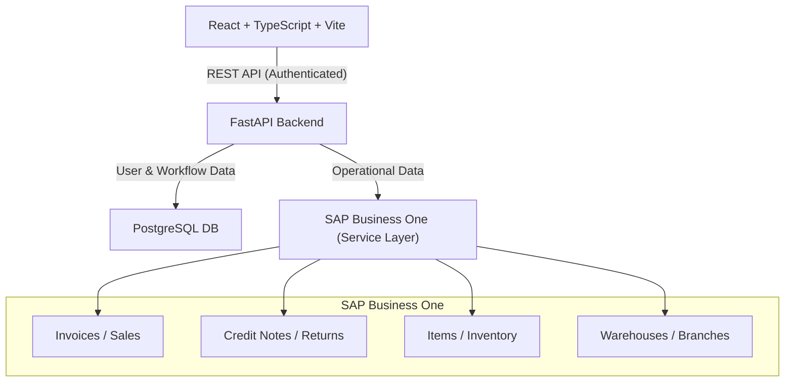

# POS-Inventory Kool

## Project Purpose & Users
POS-Inventory Kool is a comprehensive Point of Sale (POS) and inventory management system designed to connect directly with SAP Business One. The system provides real-time operational workflows for cashiers (Operators) and reporting/management tools for Administrators and Managers.

## System Architecture

## Main Modules and Data Flow
- **Frontend**: React-based SPA that handles Operator workflows (POS cart, checkout, basic dashboard) and Admin workflows (branch management, return approvals, analytics). 
- **Backend (FastAPI)**: Serves as the central API gateway. Handles user authentication natively and acts as a facade over SAP Business One.
- **PostgreSQL**: Stores user credentials, roles, branch assignments, and approval workflow requests (returns, exchanges).
- **SAP Business One**: The absolute source of truth for all operational data (products, inventory, invoices, credit notes, business partners).

## Security and Role Boundaries
- **Operator (User)**: Can view their assigned branch's dashboard, execute sales, request returns/exchanges, and view operator reports.
- **Manager**: Can view their assigned branch's analytics (Atlas Dashboard), approve/reject returns for their branch, and access operator tools.
- **Administrator**: Unrestricted access across all branches. Can create users, assign branches, run global reports, and manage all approvals.

## Current Implementation Status
- **Authentication**: Fully implemented (JWT-based, stored in PostgreSQL).
- **POS & Checkout**: Fully implemented and integrated with SAP Service Layer.
- **Approvals & Returns**: Fully implemented (Multi-step exchange, credit notes, PostgreSQL workflow state).
- **Admin Dashboard**: Implemented (aggregates SAP invoices and credit notes).
- **Atlas Dashboard**: *Next Phase* (Analytics visualization separated from Admin operations).

## Next Phase Scope: Atlas Analytics Dashboard
The upcoming Atlas Analytics Dashboard is a distinct, read-only analytics module located at `/atlas`. It will provide:
1. Executive Overview (Sales, Invoices, Average Order Value).
2. Sales Trends.
3. Inventory Insights (Current Snapshot).
4. Branch Comparison (For Admins).
5. Returns & Exceptions (SAP Credit Notes + PostgreSQL Workflow counts).

Access will be strictly limited to Managers (branch-scoped) and Administrators (global).
